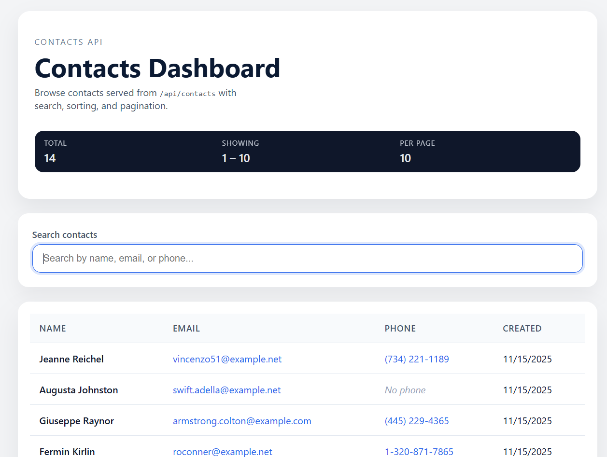
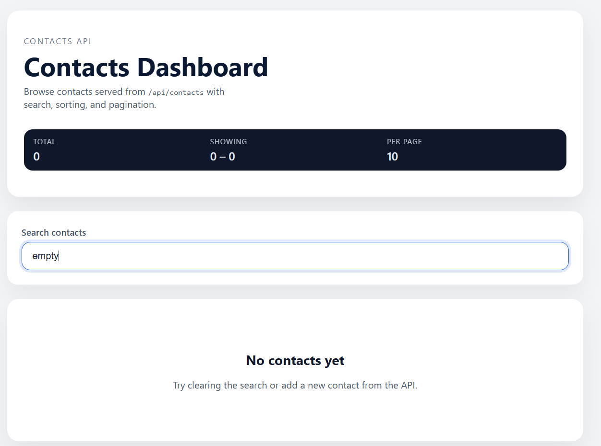
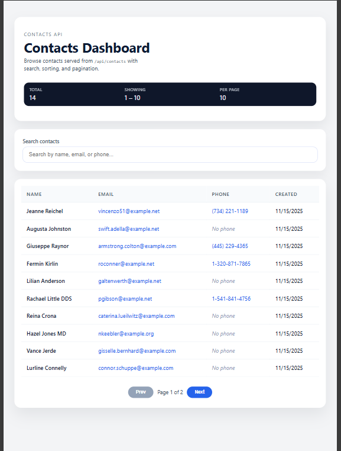
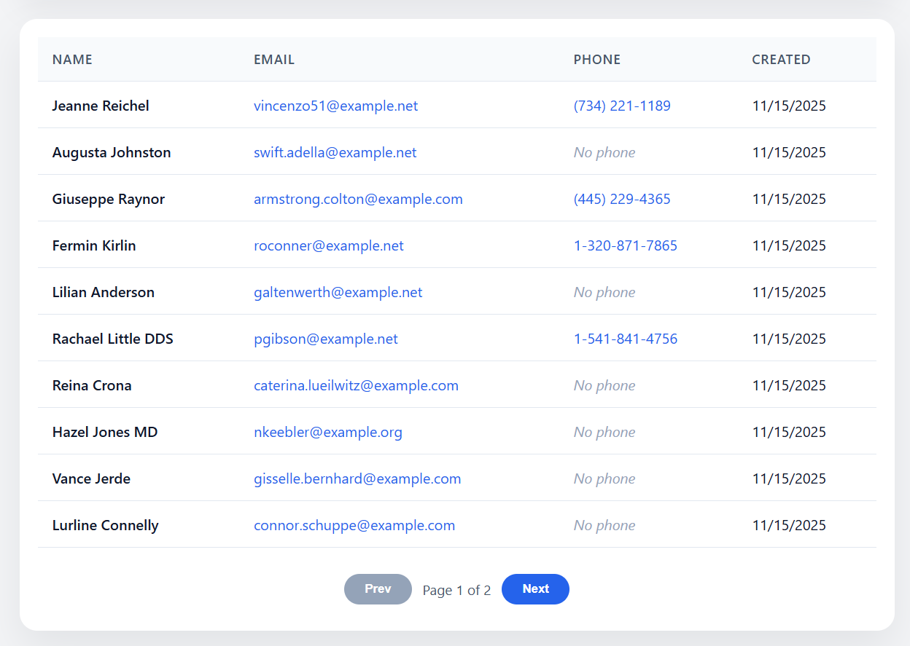

# Laravel Contacts Mini (API + Admin + Frontend)

A small **Contacts Management** application built with **Laravel 12**, designed as a portfolio project to demonstrate modern PHP practices:

- RESTful JSON API (Contacts CRUD)
- Validation and unique email handling
- Basic authorization for admin-only actions (policies)
- Filament admin panel for managing contacts
- Inertia.js + Vue frontend for searching and browsing contacts
- Automated tests for key API endpoints and rules

---

## Tech Stack

- **Backend:** Laravel 12.x (PHP 8.4, Laravel Herd)
- **Database:** SQLite (for local development & tests)
- **Admin UI:** FilamentPHP
- **Frontend:** Inertia.js + Vue 3
- **Testing:** PHPUnit (Feature tests for Contacts)
- **Tools:** Composer, Git, VS Code

---

## Features

- Create, update, list, and delete contacts via a JSON API
- Validation on `name`, `email`, and `phone`
- Unique email constraint with proper update behavior
- Admin-only delete (using Laravel policies)
- Filament admin panel to manage contacts in the browser
- Vue-based contacts page (Inertia) with loading state and search

---

## Getting Started

### Requirements

- PHP 8.4+
- Composer 2.8+
- SQLite
- Laravel Herd (or PHP CLI) installed

### Installation

```bash
git clone https://github.com/alexnaranjom/laravel-contacts-api.git
cd laravel-contacts-api

cp .env.example .env

composer install
php artisan key:generate

## Screenshots

### Contacts list view



### Empty search state



### Responsive / small screen view



### Contacts Pagination

